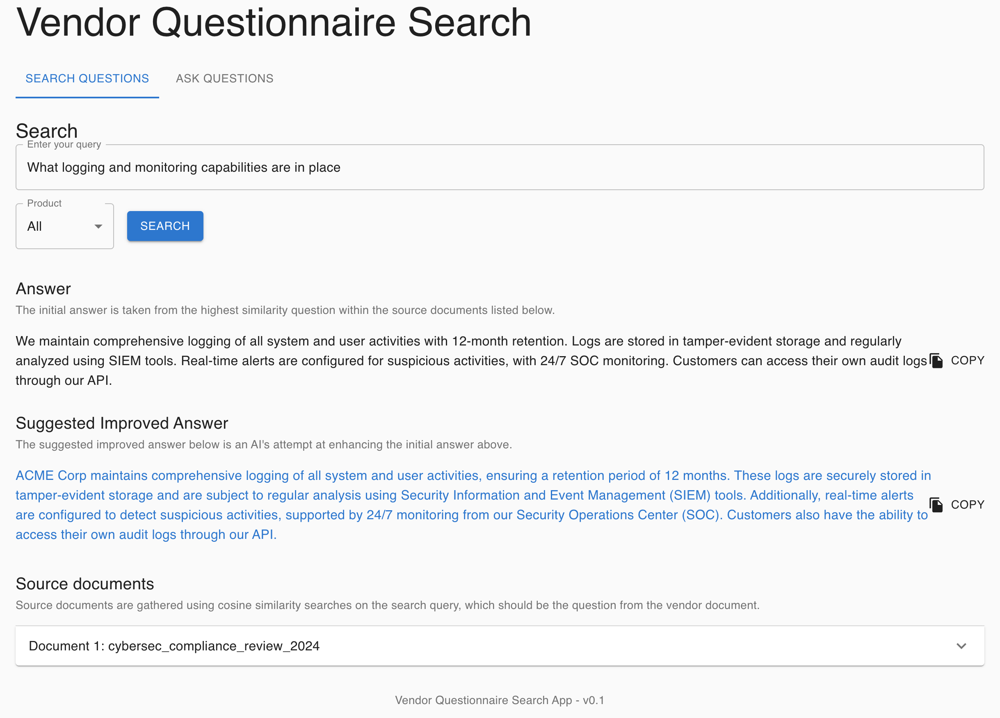
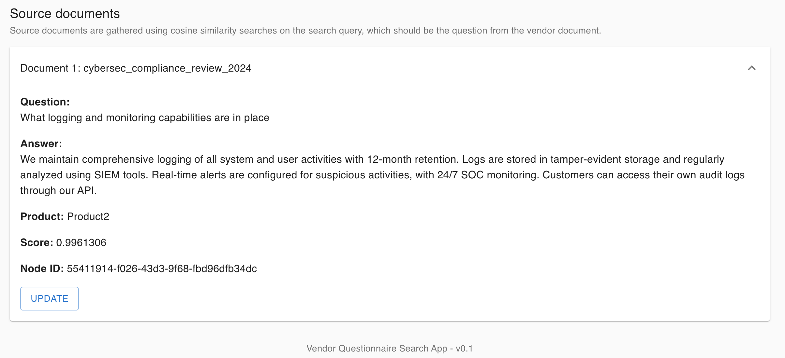
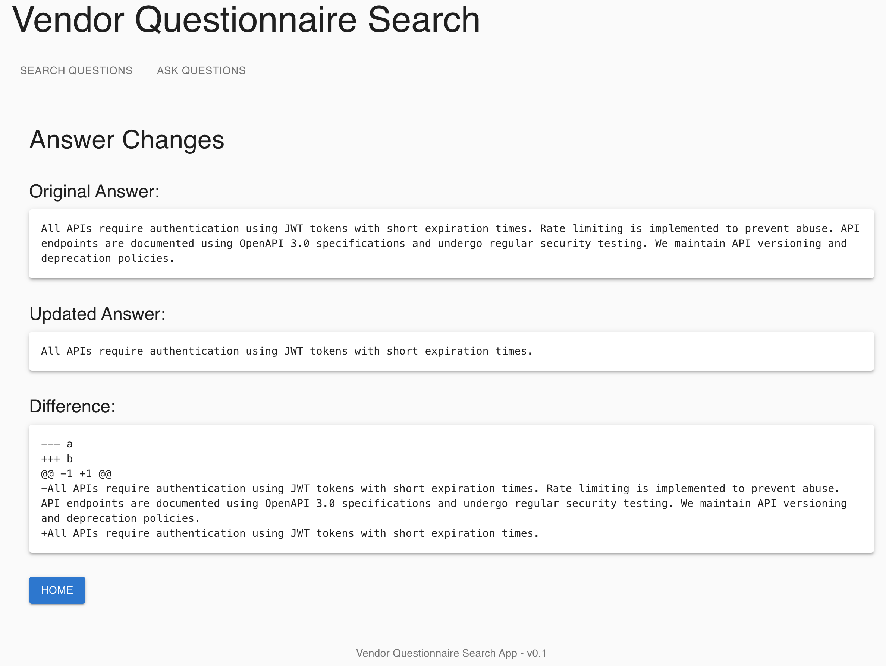
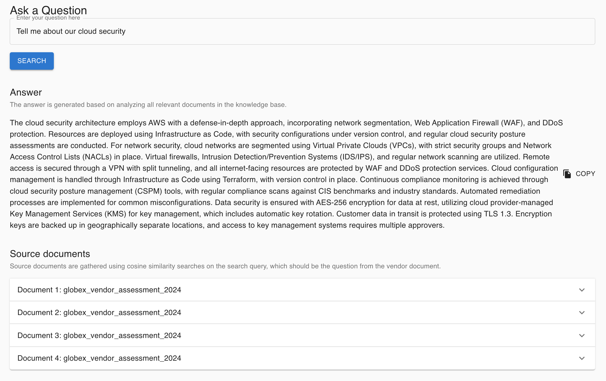
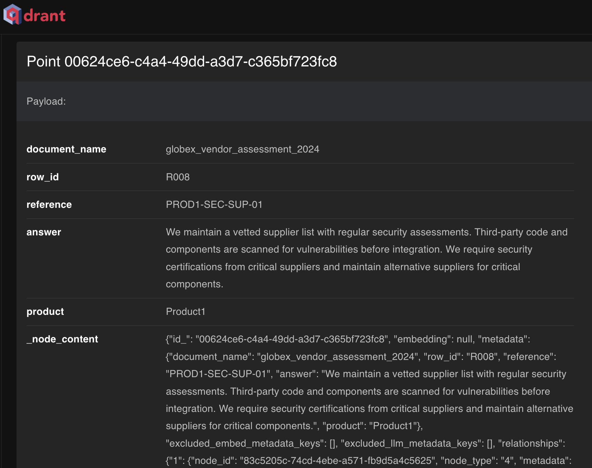

# Vendor Question and Answer RAG System

A full-stack Retrieval Augmented Generation (RAG) system for intelligent question answering and document search, built with FastAPI, React, and Qdrant vector database.

My initial proof of concept. It works, you could run it in production but you would want to do some cleanup/hardening to it. 

## Features

- **Semantic Search**: Utilizes LlamaIndex and OpenAI embeddings for intelligent document retrieval
- **Answer Generation**: Generates improved answers using LLM capabilities
- **Document Management**: Handles QA document ingestion and vector storage
- **Web Interface**: React-based UI for searching, viewing, and updating answers
- **Product Filtering**: Ability to filter searches by product
- **Answer Comparison**: Visual diff tool for comparing original and updated answers

## Purpose

The purpose of this is to assist sales teams with vendor questionnaires. Often times potential clients will send vendors a set of questions to answer around cybersecurity. This allows you to put all your previous vendor questionnaire documents into this system, then you can enable your team to search questions. The spreadsheets are often so different this is a hard process to fully automate. I've never come across one that is the same. I'm working on somethign to solve that too.

When searching for a question (taken from a vendor questionnaire) it will perform sematic search and look for similar questions. It will return the answer while also making an LLM call to try and imprpove the answer.



It will return a list of source documents so you can see which files the reference came from.



You can also update answer in the db.



You can also update ask questions over all the data in your vector store.



Data in the qdrant vector store.



## Architecture

### Backend Components
- FastAPI server for REST API endpoints
- LlamaIndex for document indexing and retrieval
- Qdrant vector database for efficient similarity search
- OpenAI embeddings for semantic understanding
- Cohere for re-ranking search results

### Frontend Components
- React-based single-page application
- Material-UI for component styling
- Real-time search and update capabilities
- Document comparison visualization

## Prerequisites

- Docker and Docker Compose
- Python 3.12+
- Node.js and npm
- OpenAI API key
- Cohere API key

I'm mostly using Cohere for rerank. You could use an alternative if you want without much (if any) impact to quality.

## Environment Variables

Create a `.env` file with the following variables:

```env
OPENAI_API_KEY=your_openai_api_key
COHERE_API_KEY=your_cohere_api_key
OPENAI_LLM_MODEL=gpt-4-turbo-preview
OPENAI_EMBEDDING_MODEL=text-embedding-3-small
TEMPERATURE=0.0
QDRANT_SERVER=http://qdrant
QDRANT_PORT=6333
QDRANT_VECTOR_COLLECTION=questions_and_answers_rag_vector
QDRANT_STORAGE_PATH=./data/storage/qdrant
QA_DIRECTORY_PATH=./data/questions_and_answers
```

## Installation and Setup

1. Clone the repository:
```bash
git clone <repository-url>
cd <repository-name>
```

2. Create necessary directories:
```bash
mkdir -p data/storage/qdrant
mkdir -p data/questions_and_answers
```

3. Start the services using Docker Compose:
```bash
docker compose build --no-cache
docker compose up -d
```

This will start:
- Qdrant vector database (ports 6333, 6334)
- Backend FastAPI server (port 8000)
- Frontend React application (port 3000)

## Data Ingestion

1. Prepare your Question and Answer data in JSON format:
```json
{
    "document_name": "cybersec_compliance_review_2024",
    "data": [
        {
            "question": "what cryptographic standards are supported",
            "answer": "We support TLS 1.3, AES-256-GCM, RSA-4096, and ECDSA with P-384 curves. Legacy protocols like TLS 1.1 and older are disabled. We follow NIST guidelines for cryptographic implementations and maintain a cryptographic agility program for algorithm updates.",
            "product": "product1"
        },
        {
            "question": "describe your security awareness training program",
            "answer": "All employees undergo mandatory security awareness training at hiring and annually thereafter. Training covers phishing, social engineering, data handling, and incident reporting. Monthly security newsletters and quarterly phishing simulations are conducted. Completion is tracked and enforced.",
            "product": "product2"
        },
        {
            "question": "what controls are in place for remote access",
            "answer": "Remote access requires VPN with MFA and is limited to corporate-managed devices. All remote sessions are monitored and logged. Split tunneling is disabled, and idle sessions are automatically disconnected after 30 minutes. Regular access reviews are performed.",
            "product": "product1"
        },
    ]
}
```

You can also have more json fields that will be added as metadata.

```json
{
    "document_name": "globex_vendor_assessment_2024",
    "data": [
        {
            "row_id": "R001",
            "reference": "PROD2-SEC-API-01",
            "question": "what controls are implemented for api security",
            "answer": "All APIs require authentication using JWT tokens with short expiration times. Rate limiting is implemented to prevent abuse. API endpoints are documented using OpenAPI 3.0 specifications and undergo regular security testing. We maintain API versioning and deprecation policies.",
            "product": "product2"
        },
        {
            "row_id": "R002",
            "reference": "PROD1-SEC-CLOUD-01",
            "question": "describe your cloud security architecture",
            "answer": "Our cloud infrastructure uses AWS with defense-in-depth principles. We implement network segmentation, WAF, and DDoS protection. All resources are deployed using Infrastructure as Code with security configurations version controlled. Regular cloud security posture assessments are performed.",
            "product": "product1"
        },
    ]
}
```

2. Place JSON files in the `./app/data/questions_and_answers` directory. I have fake samples in there for you.

3. Run it:

Once you data is in there, run ragbuilder.py and it will build the rag from your data and add everything to qdrant.

## Usage

1. Access the web interface at `http://localhost:3000`

2. Available pages:
   - Search Page: Main search interface with product filtering
   - Question Page: General question answering
   - Update Page: Edit and update answers
   - Diff Page: Compare original and updated answers if/when updated.

3. API Endpoints:
   - POST `/query`: Search with product filtering
   - POST `/ask`: General question answering
   - POST `/update`: Update answer for a specific node


## Contributing

1. Fork the repository
2. Create a feature branch
3. Commit your changes
4. Push to the branch
5. Create a Pull Request


## Acknowledgments

- LlamaIndex for the RAG framework
- OpenAI for language models and embeddings
- Qdrant for vector storage
- Cohere for re-ranking capabilities